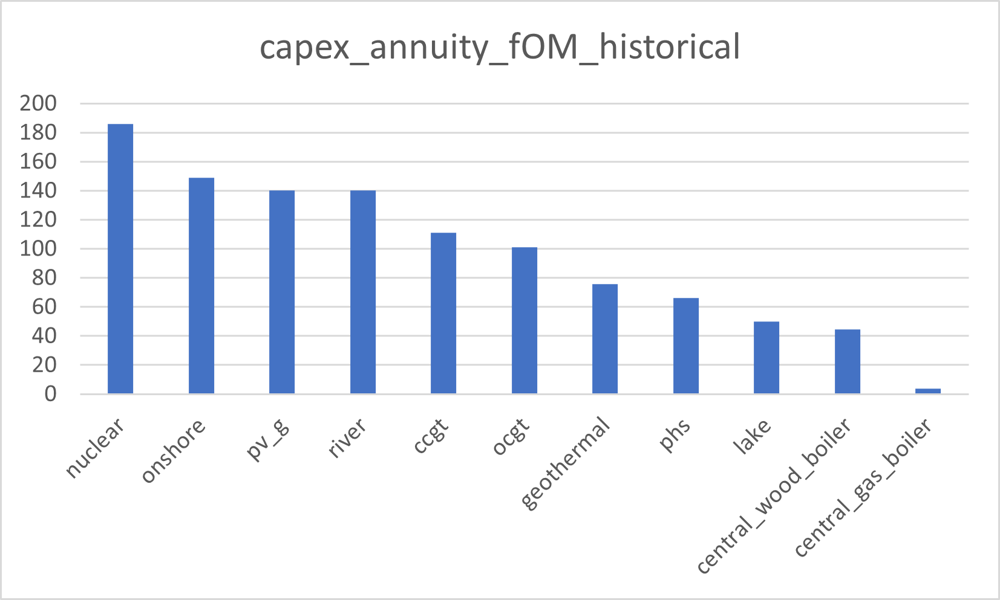
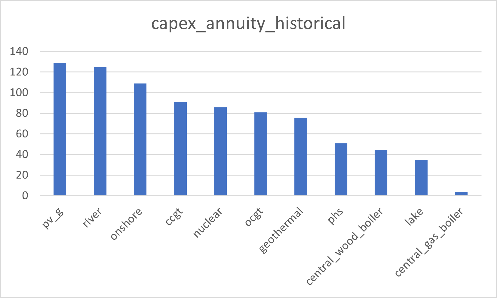
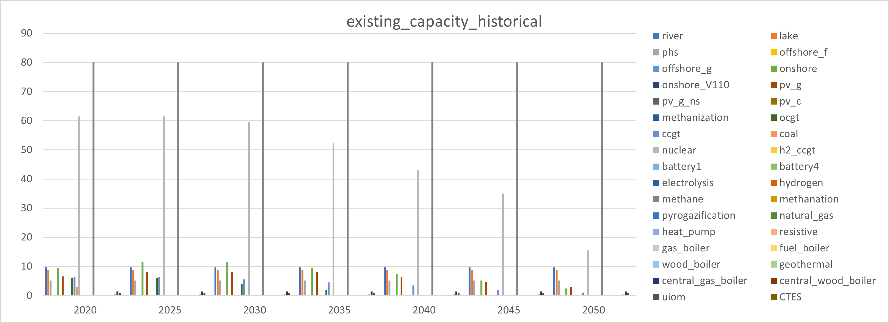
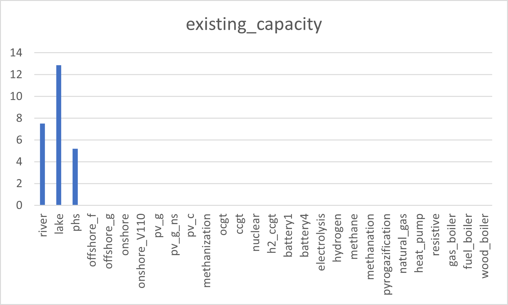

##########################################
Input data
##########################################

The "inputs" folder is subdivided into the following folders:

* additional_data
* config
* demand
* demand_data_other
* historical_data
* hourly_profiles
* policies
* technical
* technology_characteristics
* technology_potential
* xps

Each of those subfolders is quickly described below.

.. _historical_data:

Historical data (historical_data)
==================================

...