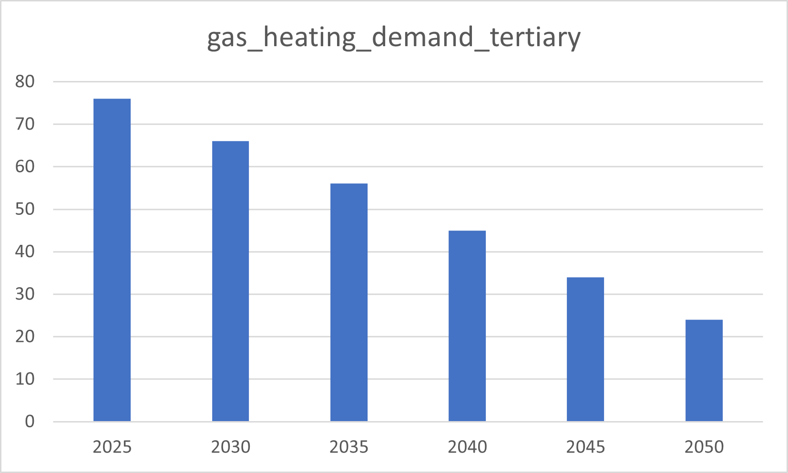
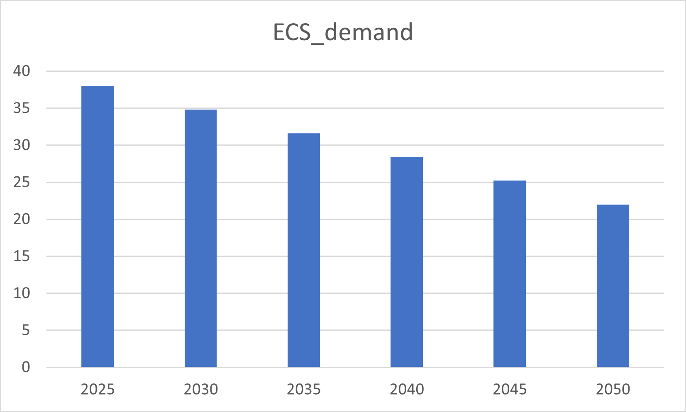
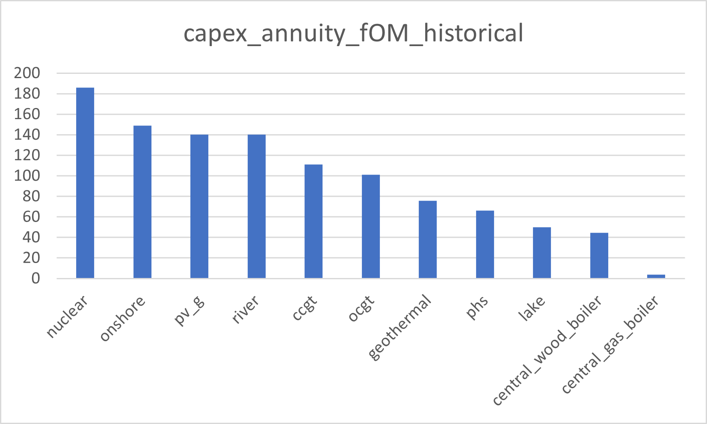
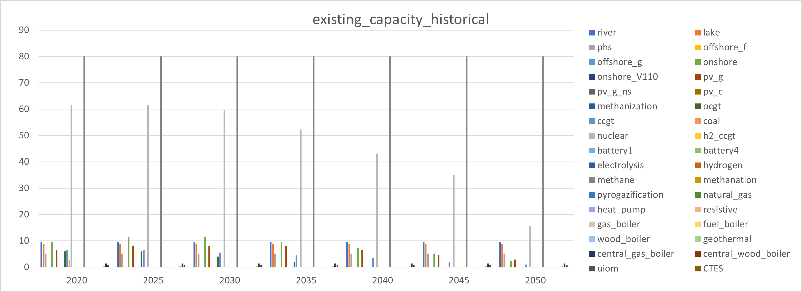
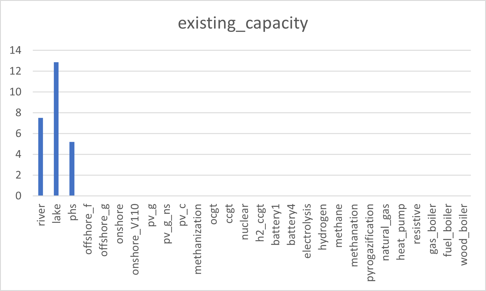
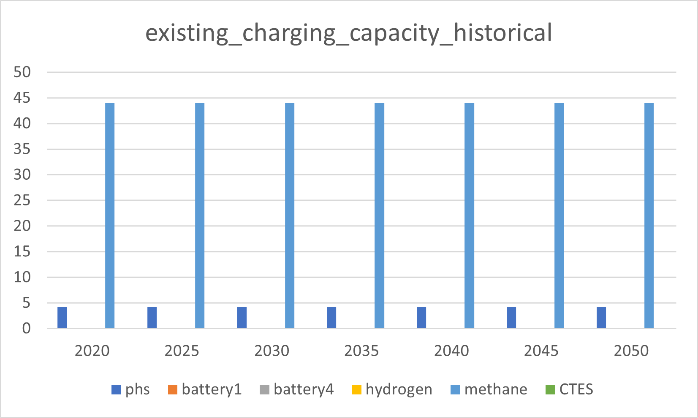
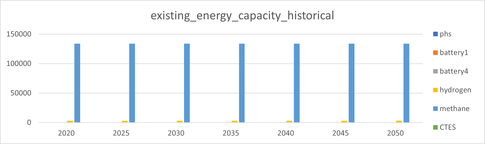
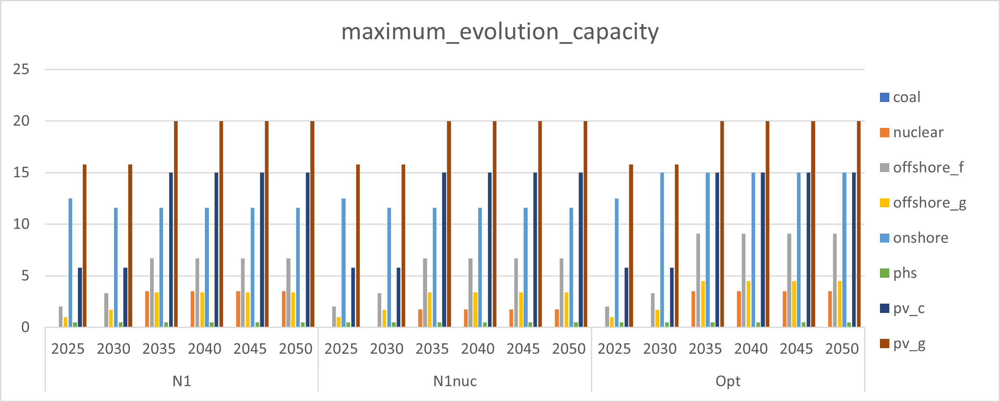

##########################################
Input data
##########################################

The "inputs" folder is subdivided into the following folders:

* additional_data
* config
* demand
* demand_data_other
* historical_data
* hourly_profiles
* policies
* technical
* technology_characteristics
* technology_potential
* xps

Each of those subfolders is quickly described below.

.. _demand:

Demand (demand)
================

Gas heating demand tertiary
----------------------------

ECS demand
----------------------------

.. _historical_data:

Historical data (historical_data)
==================================

Capex annuity fOM historical
-----------------------------

Capex annuity historical
----------------------------
.. image:: img/historical_data/capex_annuity_historical.png

Existing capacity historical
-----------------------------

Existing capacity
------------------

Existing charging capacity historical
--------------------------------------

Existing energy capacity historical
-------------------------------------

Storage annuity historical
----------------------------
.. table::
   :align: center

   +-----------+----------------------------+
   |           | storage_annuity_historical |
   +===========+============================+
   | phs       | 1.1942                     |
   +-----------+----------------------------+
   | hydrogen  | 0.06967                    |
   +-----------+----------------------------+

...

.. technology_potential:

Technology potential (technology_potential)
============================================

Maximum capacity evolution
---------------------------

